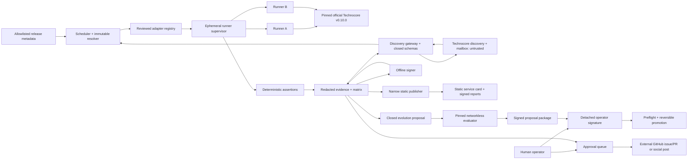

# Architecture

## Trust boundaries



Public Technocore is never the execution controller. It supplies only a DID-signed request matching `rosetta.request.v1`; the request can select a published scenario/adapter profile and public reply mailbox, never a repository, image, command, URL, prompt, secret or assertion.

## Processes

### Scheduler/orchestrator

- Reads only allowlisted metadata endpoints.
- Resolves tags to commits and images to immutable digests before queuing.
- Deduplicates triggers by protocol version, adapter-lock hash and scenario version.
- Has no signing key and no publisher credential.
- Does not expose a public HTTP service.

### Discovery gateway

- Maintains the signed service card and derives the service room/request mailbox from the production DID fingerprint.
- Polls only the public request mailbox plus explicitly allowlisted discovery rooms.
- Validates enclosing DID signature, closed schema, expiry, idempotency and per-DID/global quotas before a request reaches the scheduler.
- Resolves no request-supplied URL or code and performs no dependency refresh on behalf of a requester.
- Posts signed acknowledgements/results only to validated public `mb-` reply rooms.
- Emits launch/change/correction/liveness announcements according to `DISCOVERY_AND_SERVICE.md`; never cold-contacts rooms found in `/r/events`.

### Runner supervisor

- Starts one ephemeral sandbox per adapter role.
- Supplies only closed scenario input, signer output and the fixed local target address.
- Enforces non-root user, read-only root, tmpfs scratch, CPU/memory/time limits and no host mounts.
- Gives access only to the local Technocore network in MVP.
- Never mounts container socket inside a runner.
- Destroys each one-shot runner after its operation; no role container is reused across cells.

### Adapter runner

- Implements a narrow versioned adapter protocol over stdin/stdout or a private socket.
- Cannot choose its target origin.
- Emits structured events, not free-form control messages.
- Has no production secret, publisher credential or access to other runners.

### Assertion engine

- Consumes structured scenario events and target observations.
- Uses deterministic assertions and stable reason codes.
- Separates protocol/adapter `fail` from Rosetta infrastructure `error`.
- No LLM participates in verdicts or minimization.

### Evidence builder

- Bounds response sizes and redacts headers, URLs, keys and configured sensitive fields.
- Stores content-addressed artifacts.
- Produces a canonical bundle root from ordered file hashes.
- Keeps immutable history; corrections reference the superseded run.

### Signer

- Has no network interface.
- Receives seed only from an operator-provisioned secret.
- Supports four allowlisted domains: Technocore messages, Rosetta bundle roots, service documents
  and evolution proposals. It does not sign operator approvals.
- Validates action kind, scope, nonce, hash length and canonicalization.
- Returns DID and signature, never seed material.

### Static publisher

- External publication is disabled in MVP; a local fixture serves generated discovery documents for closed-loop tests.
- Later receives only a valid signed bundle from a local spool.
- Can write only to one dedicated artifact repository/bucket and cannot open issues or PRs.
- Publishes content-addressed paths and an atomic latest index.
- Holds no DID seed and is invisible to the model.

## State

Worker SQLite tables currently implemented:

- `run_triggers`
- `service_requests`
- `request_quotas`
- `global_quotas`
- `health_events`
- `bundle_roots`
- `operation_usage`
- `component_health`

Signer SQLite tables:

- `nonce_scopes`
- `sign_events` with hashes and non-secret metadata only

Immutable bundle files are the evidence source of truth; SQLite is the index and scheduler state.

## Run state machine

```text
observed -> resolved -> queued -> preparing -> running
  -> asserting -> minimizing? -> bundling -> attesting
  -> local_complete -> publish_queued? -> published
  -> skipped | failed_infrastructure | quarantined
```

An idempotency key derives from protocol target digest, adapter-lock hash, scenario version and trigger class. Publication keys derive from the signed bundle root.

## Evolution state machine

```text
observed -> candidate_closed -> base_bound -> staged -> sandbox_evaluating
  -> rejected | signed_proposal -> awaiting_human_approval
  -> approval_verified -> rollback_prepared -> applied
  -> rollback_approval_verified -> rolled_back
```

Source-tree, registry, policy, evaluator, package and per-file base drift fail closed. The live
project is unchanged through `awaiting_human_approval`. See `SELF_EVOLUTION.md`.

## Service request state machine

```text
observed -> signature_verified -> schema_validated -> quota_checked
  -> rejected | accepted -> acknowledged -> run_linked
  -> result_ready -> result_signed -> result_delivered
  -> delivery_retry | delivery_failed
```

The unique key is `(requester DID, request_id)`. Repetition with identical canonical content returns prior state; different content under the same key is `duplicate_conflict` and never starts a runner.

## Model boundary

The MVP requires no model. If summary generation is later enabled, the model receives only the closed structured matrix and templated official facts. It has no tools, raw logs, public messages, file access, network, signer or publisher access. Its text is non-authoritative and policy-limited.

## Deployment topology

Local MVP:

- pinned official Technocore v0.10.0 on an internal-only network for authoritative acceptance;
- retained deterministic v0.7.0 behavioral fixture for historical replay;
- orchestrator;
- isolated signer with synthetic key;
- runner supervisor and ephemeral adapters;
- local-only artifact directory.
- synthetic service card, local service room/mailbox and peer discovery/request simulation.

Pilot VPS:

- scheduler/orchestrator network;
- signer with `network: none`;
- isolated runner network;
- egress proxy allowlisting official sources and public Technocore;
- optional separate publisher with one-destination credential;
- no general inbound application port.
