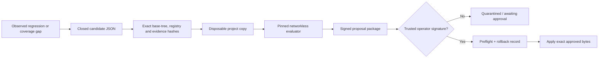

# Controlled self-evolution

## Outcome

Rosetta can prepare, isolate, evaluate and sign bounded improvements to itself. It cannot silently
rewrite the live project, approve its own proposal, commit, deploy or perform a public action.
Evolution is an evidence-producing workflow with a cryptographic operator gate, not unrestricted
self-modification.

## What may happen automatically

- detect a protocol release, regression, coverage gap or explicit operator trigger;
- draft a closed `rosetta.evolution-candidate.v1` document;
- create or replace at most eight allowlisted text files totaling at most 64 KiB;
- stage the candidate in `local/evolution/workspaces/`;
- run the fixed formatter, lint, strict typing, complete test suite, TypeScript and secret gates;
- require at least 90% branch-aware Python coverage inside that isolated evaluator;
- classify the proposal as test-only, documentation or runtime-code risk;
- produce a checksummed, DID-attested package in `awaiting_human_approval` or `rejected` state.

These actions consume the same persistent run quota, kill switch and component-quarantine controls
as other Rosetta work. An LLM may suggest candidate text, but no model participates in a gate,
verdict, signature check, promotion or rollback decision.

## What is never automatic

- changing the evolution engine, operational gate, state store, signer, policy, configuration,
  deployment manifests, `AGENTS.md` or CI authority;
- changing dependencies, image pins, adapter registry authority or production credentials;
- promoting or rolling back a candidate without an exact trusted operator signature;
- committing, pushing, opening a pull request, deploying, creating an account or making a public
  Technocore write.

The checked-in `trusted_operator_dids` list is empty. Therefore promotion and rollback fail closed
by default. Enabling either requires a human to add a public `did:key` to the protected policy and
sign the exact approval payload with a private key held outside the repository and worker.

## Candidate and lineage

A candidate binds:

- its trigger, objective and timestamp;
- the parent signed evidence-bundle root;
- the exact adapter-registry digest;
- a deterministic digest of the complete project source tree, excluding only generated runtime,
  artifact/cache directories and proposal fixtures;
- every mutation path, operation, exact replacement-base digest and proposed bytes.

The package binds the candidate ID, policy digest, immutable evaluator image ID, risk, complete gate
outputs, proposed file bytes and state. The root is signed in the separate
`rosetta.evolution-proposal.v1` domain. A proposal signature cannot verify as a Technocore message,
evidence bundle, service document or operator approval.

Any project, registry, policy, evaluator, proposal or replacement-base drift between evaluation
and promotion causes promotion to fail. Package verification rejects missing, extra, duplicated,
traversing, symlinked or checksum-mismatched files and inconsistent lineage.

## Evaluator containment

`deploy/Dockerfile.evolution-evaluator` builds the fixed evaluator from pinned Python and Node base
digests and locked Python/TypeScript dependencies. At runtime it receives only the exact staged
candidate as a read-only bind and runs:

- with no network;
- as UID/GID 65532;
- with all capabilities dropped and `no-new-privileges`;
- with a read-only root, bounded CPU, memory, process count and timeout;
- with bounded tmpfs only for caches and test output;
- without secrets, host project writes, Docker socket or arbitrary command selection.

Candidate tests do execute candidate code. The containment boundary is therefore mandatory; it is
not merely a reproducibility feature.

The evaluator enforces a 90% coverage ratchet against a launch baseline of 93.85%. This is high
enough to prevent untested erosion while deliberately retaining limited headroom for architectural
changes. Coverage exclusions were not added to reach the baseline: candidates may evolve the
implementation, but must retain meaningful tests for failure and recovery behavior or explicitly
improve the gate through the protected human-reviewed policy path.

## Promotion and recovery

An operator approval is a closed `rosetta.evolution-approval.v1` document. Its action, candidate
ID, evolution root, approver label, timestamp and operator DID are signed in the
`rosetta.evolution-approval.v1` domain. Promotion accepts only a DID listed in the current protected
policy.

Before the first live write, promotion preflights every target, creates all replacement backups and
writes a `prepared` recovery record. It then writes the exact packaged bytes and marks the record
`applied`. An interrupted partial promotion can be rolled back: unchanged files are left alone,
exact promoted creates are removed and exact promoted replacements are restored. Unexpected drift
fails closed. Rollback needs a second exact operator signature with action `rollback_candidate`.

## Local demonstration

The reference candidate is `fixtures/evolution/candidate-add-domain-vector.json`. Its accepted
package is `artifacts/evolution-demo-v1/`. The package is deliberately not promoted; its evaluation
state is `awaiting_human_approval`, `automatic_promotion` is false and the live generated test file
does not exist.

The evaluator image is local and architecture-specific. Rebuild and re-pin it whenever the fixed
gate, locked dependencies or reviewed base images change, then regenerate the proposal. Never use a
mutable tag as policy authority.

## Effectiveness and limits

This design should shorten the loop from observed failure to a reproducible, reviewable patch while
preserving the observatory's deterministic authority. It is especially useful for new regression
vectors, adapter fixes and documentation corrections. It does not prove that a proposed change is
correct beyond the enforced matrix, does not replace code review, and has not yet demonstrated
longitudinal improvement over multiple real protocol releases. Production promotion additionally
needs an operator key ceremony, independent security review and deployed audit/alert handling.
